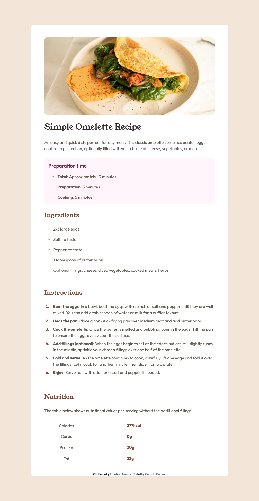

# Frontend Mentor - Recipe page solution

This is a solution to the [Recipe page challenge on Frontend Mentor](https://www.frontendmentor.io/challenges/recipe-page-KiTsR8QQKm). Frontend Mentor challenges help you improve your coding skills by building realistic projects. 

## Table of contents

- [Overview](#overview)
  - [The challenge](#the-challenge)
  - [Screenshot](#screenshot)
  - [Links](#links)
- [My process](#my-process)
  - [Built with](#built-with)
  - [What I learned](#what-i-learned)
  - [Useful resources](#useful-resources)
- [Author](#author)

## Overview

### The challenge 

This challenge will help you focus on writing semantic HTML. Ensure you think through what HTML elements are most appropriate for each piece of content.

### Screenshot

### Links

- Solution URL: [Repo on GitHub](https://github.com/MpZero/frontend-mentor/tree/main/recipe-page)
- Live Site URL: [Recipe Page](https://mpzero.github.io/frontend-mentor/recipe-page/)

## My process

### Built with

- Semantic HTML5 markup
- CSS custom properties
- CSS Grid
- Mobile-first workflow

### What I learned

- The importance of semantic HTML5.
- The importance of responsive Web Design.
- How to structure a recipe page.
- Design ideas for future projects.

### Useful resources

- [Web Content Accessibility Guidelines (WCAG)](https://www.w3.org/WAI/standards-guidelines/wcag/) - 
- [WebAIM's WCAG 2 Checklist](https://webaim.org/standards/wcag/checklist) - 
- [ARIA Landmarks Example](https://www.w3.org/WAI/ARIA/apg/patterns/landmarks/examples/general-principles.html) -

## Author

- GitHub - [Gonzalo Gomez](https://github.com/MpZero)
- Frontend Mentor - [@MpZero](https://www.frontendmentor.io/profile/MpZero)
- LinkedIn - [Gonzalo Gomez](https:/www.linkedin.com/in/gonzalo-agustin-gomez-b98709318)
