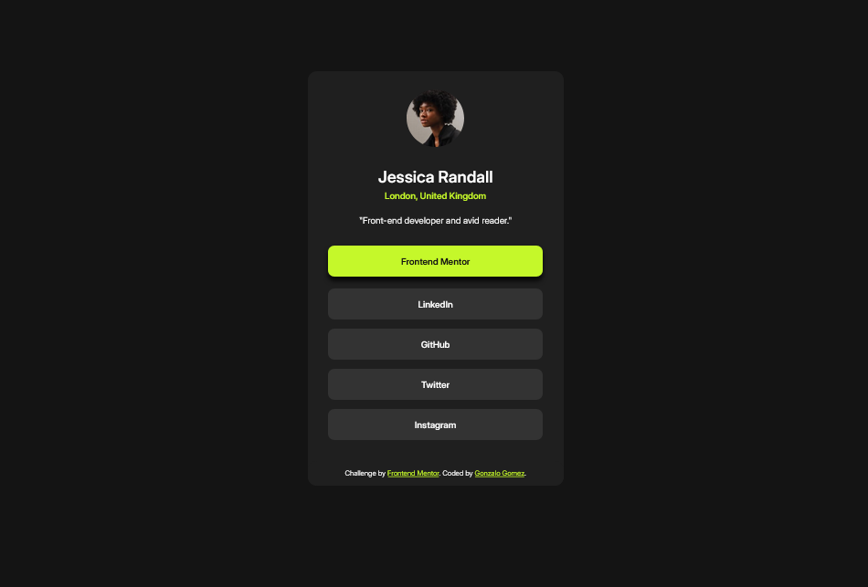

# Frontend Mentor - Social links profile solution

This is a solution to the [Social links profile challenge on Frontend Mentor](https://www.frontendmentor.io/challenges/social-links-profile-UG32l9m6dQ). Frontend Mentor challenges help you improve your coding skills by building realistic projects. 

## Table of contents

- [Overview](#overview)
  - [The challenge](#the-challenge)
  - [Screenshot](#screenshot)
  - [Links](#links)
- [My process](#my-process)
  - [Built with](#built-with)
  - [What I learned](#what-i-learned)
  - [Useful resources](#useful-resources)
- [Author](#author)

## Overview

### The challenge 

In this small project, you'll build out your social link-sharing profile. You can even personalize it and use it to share all your social profiles!

### Screenshot

### Links

- Solution URL: [Repo on GitHub](#)
- Live Site URL: [Social Links page](#)

## My process

### Built with

- Semantic HTML5 markup
- Mobile-first workflow
- CSS custom properties
- CSS Grid
- CSS animations

### What I learned

- Reinforced semantic HTML5.
- Reinforced responsive Web Design.
- How to structure a social links page.
- Design ideas for future projects.

### Useful resources

- [Web Content Accessibility Guidelines (WCAG)](https://www.w3.org/WAI/standards-guidelines/wcag/) - 
- [WAVE Web Accessibility Evaluation Tool](https://wave.webaim.org/report#/https://6nkksv.csb.app/) - 
- [CSS transitions by Josh W Comeau](https://joshwcomeau.com/animation/css-transitions/) -
- [MDN Styling Links](https://developer.mozilla.org/en-US/docs/Learn/CSS/Styling_text/Styling_links)

## Author

- GitHub - [Gonzalo Gomez](https://github.com/MpZero)
- Frontend Mentor - [@MpZero](https://www.frontendmentor.io/profile/MpZero)
- LinkedIn - [Gonzalo Gomez](https:/www.linkedin.com/in/gonzalo-agustin-gomez-b98709318)